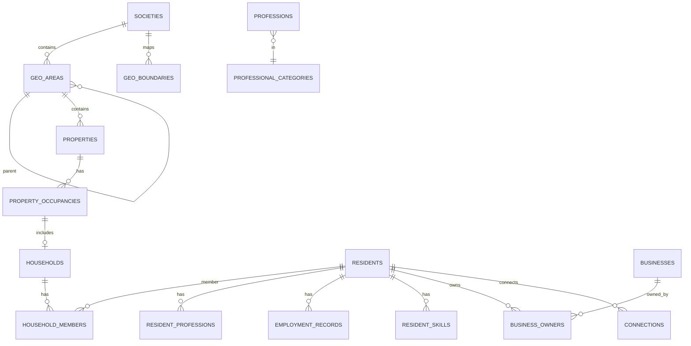

# Database Design

## Principles

1. Normalize entities; avoid “god” resident JSON documents.  
2. Every tenant table includes `society_id` (+ index).  
3. History for occupancy—don’t overwrite move-out.  
4. Taxonomies are data, not enums frozen in code.  
5. PostGIS for boundaries/points; keep WGS84 (`EPSG:4326`).  
6. Privacy settings and consents are first-class tables.  
7. Prefer UUID/`cuid` string IDs for public APIs; optional bigint internals later if needed.  
8. `created_at` / `updated_at` on mutable tables; soft-delete only where retention requires it.

> ORM choice (Prisma vs Drizzle) is finalized in Milestone 0. Schema below is logical/ER; physical types may use `geometry(Geometry, 4326)`.

---

## Proposed ERD (core)

```text
platform_users
    │
    ├── society_memberships ──► societies ──► society_settings
    │                              │
    │                              ├── geo_level_definitions
    │                              ├── geo_areas (parent_id, level, geom)
    │                              ├── streets / plots
    │                              ├── properties (geo_area_id, geom point/poly)
    │                              ├── geo_boundaries / geo_features
    │                              │
    │                              ├── property_occupancies
    │                              │       └── households
    │                              │              ├── household_members ──► residents
    │                              │              └── dependents (restricted)
    │                              │
    │                              └── residents ◄── resident_profiles
    │                                       ├── resident_contacts
    │                                       ├── resident_privacy_settings
    │                                       ├── consent_records
    │                                       ├── resident_professions ──► professions ──► professional_categories
    │                                       ├── employment_records ──► industries
    │                                       ├── resident_skills ──► skills
    │                                       ├── resident_interests ──► interests
    │                                       ├── education_records
    │                                       ├── business_owners / business_staff ──► businesses
    │                                       ├── connections / follows
    │                                       └── ...
```

---

## Entity notes

### `societies` / `society_settings`

Tenant root. Settings include aggregation thresholds, enabled geo levels, feature flags, branding tokens.

### `geo_level_definitions`

Configurable labels/order: e.g. `phase`, `sector`, `block`.

### `geo_areas`

Tree of areas; optional `geom` multipolygon; `code`, `name`, `society_id`.

### `properties`

Links to leaf geo area; optional plot/street; `property_type`; `geom`; administrative address fields (restricted).

### `property_occupancies`

`property_id`, `status` (owner_occupied/rented/vacant), `started_at`, `ended_at`, `household_id` nullable until formed.

### `households` / `household_members`

Household is not identical to property. Members have roles (primary contact, spouse, adult child, etc.).

### `residents`

Society person. `platform_user_id` nullable until invited/claimed. Status: active/inactive/pending. Profile completeness + `last_verified_at`.

### `dependents`

Separate from residents. Guardian links via `guardian_relationships`. **Default private.** Age band preferred over DOB.

### Professions & skills

Hierarchical categories → professions → optional job titles. `resident_professions` M:N with primary flag. Skills M:N with proficiency optional.

### `employment_records` / `education_records`

Time-bounded; skills can associate to a role for richer intelligence.

### `businesses`

Category, industry, location geom, verification state, hiring flags, resident discount flags. Owners/staff as join tables.

### Social / opportunity / messaging

Standard normalized tables: posts, media, comments, reactions, announcements (+ audience), events/attendees, opportunities/applications, conversations/members/messages/attachments/reads, notifications/preferences, polls/options/votes, achievements, reports, moderation_actions, audit_logs, saved_searches.

### Analytics

`analytics_events` (append-only product/domain events)  
`analytics_snapshots` (precomputed KPI/geo/profession aggregates with privacy metadata)

---

## Critical indexes (illustrative)

- `(society_id)` on all tenant tables  
- `(society_id, lower(full_name))`, FTS vectors on residents/businesses/posts  
- `pg_trgm` on name/skill/profession labels  
- GIST on all geometry columns  
- `(society_id, geo_area_id)` for choropleth joins  
- `(household_id)`, `(property_id, ended_at)` for occupancy  
- Unique partial indexes for active memberships / primary contacts where needed  

---

## Privacy-related columns

Avoid scattering booleans only. Use:

- `resident_privacy_settings` — per-field or per-field-group visibility  
- `consent_records` — purpose, version, granted_at, revoked_at  
- Resource-level flags (e.g. `businesses.visibility`)  

Serializers must consult these **before** returning DTOs.

---

## Aggregation threshold

Society setting `heatmap_min_bucket_size` (default **5**). Snapshot jobs suppress buckets below threshold for non-admin views.

---

## Import staging

Staging tables (`import_jobs`, `import_rows`) hold preview/validation state before commit—never silent drop.

---

## ER diagram (Mermaid)



Detailed column catalogs will live next to migrations once the ORM is chosen; this document is the normative relational design.
